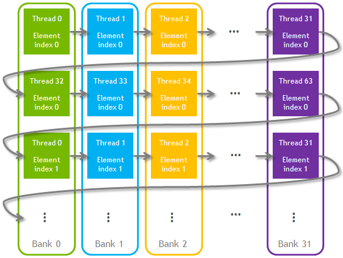

# Week 2 Observations

Source run: timestamp 20260728_035801 (files in results/raw_out)

## Memory access
- Contiguous bandwidth: 2867.228 GB/s (CUDA, size=67108864, stride=1, iterations=100)
- Strided bandwidth: 447.559 GB/s (CUDA, size=67108864, stride=64, iterations=100)
- Notes: bandwidth drops by about 6.41x from contiguous to stride 64 at the same size.

## Matrix transpose
- Naive time: 0.015197 ms (naive_b16, rows=3072, cols=777, iterations=100)
- Coalesced time: 0.009638 ms (tiled_t32_br8, rows=3072, cols=777, iterations=100)
- Effective bandwidth: 1981.261 GB/s (tiled_t32_br8, rows=3072, cols=777, iterations=100)

## Matrix multiplication
- CPU reference: not separately timed in this benchmark run (used as correctness reference only)
- Naive CUDA: 0.109888 ms, 1838.056 GFLOP/s (naive_b16, M=511, N=257, K=769, iterations=100)
- Tiled CUDA: 0.074265 ms, 2719.733 GFLOP/s (tiled_t8, M=511, N=257, K=769, iterations=100)

## Main observations
1. Coalesced contiguous memory access is much more bandwidth efficient than high-stride access.
2. For transpose, tile size 32 with block rows 8 gave the best throughput in these runs.
3. For matmul, tiled kernels outperformed naive kernels, with tiled_t8 giving the strongest result on both square and ragged cases.

## Q&A
- What makes a global-memory access coalesced?
```
A global-memory access is coalesced when threads in the same warp access addresses that are close together and aligned, so the hardware can serve them with a smaller number of memory transactions. This is why contiguous copy is much faster than strided copy. Contiguous accesses are coalesced whereas strided is not.
```
- Why does matrix transpose need shared-memory tiling?
```
Transpose naturally turns a global-memory access into a strided pattern, which is inefficient. Without tiling, reads aor writes become poorly coalesced, because of which each warp triggers many memory transactions and the bandwidth drops.

Shared-memory tiling fixes this by splitting the work in two phases - read from the global memory in a coalesced row and write the transposed tile back in a coalesced row fashion. All the reordering takes place in shared memory, hence eliminating the latency incurred by global uncoalesced reads. This matches the experiments where tiled transpose is faster than naive transpose.
```
- What problem does the extra transpose padding column solve?
```
In CUDA, shared memory is divided into 32 equally sized memory banks that can be accessed simultaneously. A warp also consists of 32 parallel threads, creating a direct 1:1 mapping when things are optimized.
Shared memory addresses are statically interleaved across the 32 banks. Successive 32-bit (4-byte) words map to successive banks.

Formula: Bank Index = (Byte Address / 4) % 32

In a __shared__ float tile[32][32]:
Row-Major Access (Conflict-Free): Threads 0 to 31 read tile[0][0] through tile[0][31].Thread 0 accesses Bank 0, Thread 1 accesses Bank 1, and so on. Every thread hits a different bank. The hardware services this in a single clock cycle.
Column-Major Access (32-Way Conflict):Threads 0 to 31 read tile[0][0] through tile[31][0]. Because each row is exactly 32 words wide, every element in that column shares the same memory bank. Thread 0 (Row 0, Col 0) maps to Bank 0.Thread 1 (Row 1, Col 0) maps to (32 / 4) % 32, which wraps back to Bank 0. All 32 threads demand data from Bank 0 at the same time. The hardware must serialize these requests, taking 32 cycles instead of 1.

By changing the allocation to __shared__ float tile[32][33], you shift the memory alignment.
The Shift: Each row now contains 33 words instead of 32.
Row 0: Starts at Bank 0, ends at Bank 0 (using 33 banks total via wrap-around).
Row 1: Starts at Bank 1.
Row 2: Starts at Bank 2.
The New Column Mapping: When threads read column 0 (tile[0][0], tile[1][0], tile[2][0]): 
Thread 0 reads Row 0 (Bank 0)
Thread 1 reads Row 1 (Bank 1)
Thread 2 reads Row 2 (Bank 2)

Conflict free Shared memory storage. The thread block size here is 64.
```


Also see [Coalesed memory access](https://damek.github.io/random/basic-facts-about-gpus/)

- What data is shared between threads in tiled matrix multiplication?
```
In tiled matrix multiplication, threads in a block share the current tiles of input matrices (A) and (B) through shared memory.

For each phase (t):
```
* one thread block loads a tile of (A)
* the same block loads a tile of (B)
* those tiles are stored in shared arrays (like As and Bs)
* every thread in the block reuses those shared values to accumulate its output element
```
So the shared data is:

The tile of (A) needed by all threads in the block for that phase.
The tile of (B) needed by all threads in the block for that phase.
This is what gives the speedup: each global-memory value is loaded once into shared memory, then reused by many threads, reducing global memory traffic and improving arithmetic intensity.
```
- Why is synchronization required after loading a tile?
```
Preventing Race Conditions: Loading and transposing a matrix is a two-step process: writing data into the shared memory tile, and then reading it out. Without a barrier, faster threads would attempt to read data from the tile before slower threads have finished writing it.

Warp vs. Block Mechanics: While threads within a single 32-thread warp execute instructions in lockstep, different warps inside the same block do not. A thread block often contains multiple warps that execute at completely different speeds.

Ensuring Data Integrity: __syncthreads() acts as a execution barrier. It forces every thread in the block to pause until all threads have completed their global-to-shared memory writes, ensuring the entire tile is safely populated before anyone reads it.
```
- Why is synchronization required before loading the next tile?
```
This is to prevent the WAR(Write-After-Read) condition, where loops reuse the same chared memory allocation.
The Complete Tile Lifecycle
To process data across multiple loop iterations safely, a double-barrier system is required:
* Load Data: Threads load data from global memory into the shared memory tile.
* __syncthreads(); (Read-After-Write Barrier): Ensures all threads have finished writing before anyone starts reading.
* Process/Compute: Threads read and process the data from the shared memory tile.
* __syncthreads(); (Write-After-Read Barrier): Ensures all threads have finished reading before anyone loops back to overwrite the tile with the next block of data.
```
- How does tile size affect shared-memory use?
```
As tile size increased from 8→16→32, shared-memory use per block increased from 512 B → 2 KB → 8 KB (a (16x) increase from 8 to 32), while measured matmul throughput on (511x257x769) dropped from 2719.7 → 1329.4 → 441.7 GFLOP/s.
```
- How can tile size affect occupancy?
```
As tile size increases, each block becomes “heavier.” Fewer such blocks can fit concurrently on an SM, so occupancy can drop. Lower occupancy means less ability to hide latency, which often hurts throughput.
tiled_t8: 2719.7 GFLOP/s
tiled_t16: 1329.4 GFLOP/s
tiled_t32: 441.7 GFLOP/s
So, larger tiles likely reduced effective occupancy enough to outweigh any reuse benefit, making performance worse.
```
- Why can tiled matmul outperform naive matmul?
```
Tiled matmul can outperform naive matmul because it increases data reuse and reduces expensive global-memory traffic.
On (M=511, N=257, K=769) (100 iterations):
naive_b16: 1838.056 GFLOP/s, 0.109888 ms
tiled_t8: 2719.733 GFLOP/s, 0.074265 ms
```
- Why might tiled matmul still be much slower than cuBLAS?
```
* cuBLAS is highly optimized for non-divisible dimensions, alignment, and launch configuration selection. Generic kernels often pay larger overhead penalties for ragged shapes.
* cuBLAS kernels are tuned to maximize effective occupancy while avoiding register and shared-memory bottlenecks. This tile choice may improve reuse but still reduce occupancy or create other bottlenecks.
* cuBLAS uses sophisticated global/shared/register tiling, prefetching, double buffering, and latency hiding. This implementation has a simpler load-compute-sync loop.
* cuBLAS can use Tensor Cores (with TF32/FP16/BF16/FP8 paths) and optimized MMA pipelines. A standard FP32 CUDA kernel may not use these fast paths at all.
```
- What happens when M, N, or K is not divisible by the tile size?
```
Edge handling overhead contributes to lower efficiency than perfectly tile-aligned dimensions.
```
- What is the difference between memory bandwidth and effective bandwidth?
```
Memory bandwidth (peak/theoretical)
* Maximum data rate the GPU memory system can deliver under ideal conditions.
* Determined by hardware specs (memory clock, bus width, HBM/GDDR config).
Effective bandwidth (measured)
* Depends on access pattern, coalescing, cache behavior, divergence, occupancy, and overheads.
* Always less than or equal to peak bandwidth in practice.
So: peak bandwidth tells what the hardware could do; effective bandwidth tells what the implementation did.
```