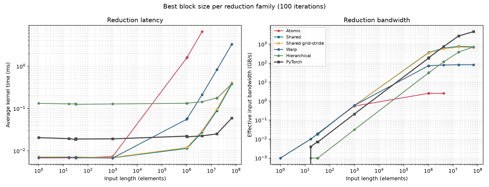
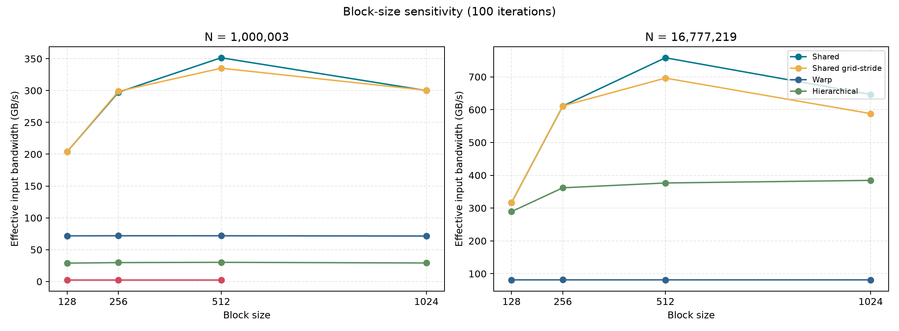
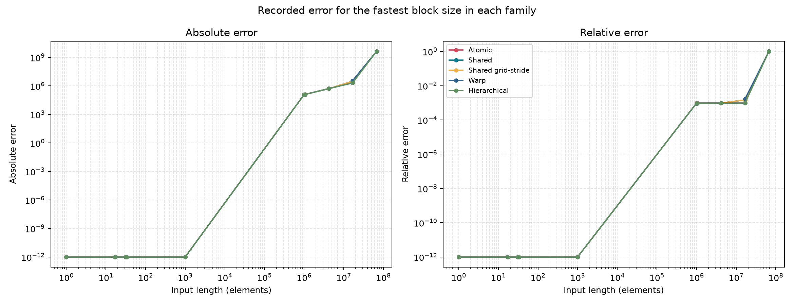

# Week 3 Observations

Source run: `20260805_063533` on an NVIDIA GB200 (152 SMs, CUDA 13.0, PyTorch 2.13.0). Results below use the 100-iteration averages. For each CUDA family, comparisons use the fastest measured block size at each input length.

## Reduction strategies benchmarked
- `atomic`: global `atomicAdd` per thread; intentionally skipped above `N=4,194,304` because serialization makes it too slow.
- `shared`: shared-memory tree reduction with one `atomicAdd` per block.
- `shared_gs`: shared-memory reduction with grid-stride input accumulation.
- `warp`: register shuffle reduction with one `atomicAdd` per warp.
- `hierarchical`: two-pass reduction through a per-block partial-sum buffer, with no global atomic update to the final result.

## Results

### Scaling

| Input length | Fastest custom kernel | CUDA time | CUDA bandwidth | PyTorch time | PyTorch bandwidth |
|---:|---|---:|---:|---:|---:|
| 1,000,003 | `shared_b512` | 0.011379 ms | 351.520 GB/s | 0.022227 ms | 179.963 GB/s |
| 1,048,576 | `shared_b512` | 0.011601 ms | 361.558 GB/s | 0.021447 ms | 195.563 GB/s |
| 4,194,304 | `shared_b512` | 0.027552 ms | 608.929 GB/s | 0.022547 ms | 744.093 GB/s |
| 16,777,216 | `shared_b512` | 0.088888 ms | 754.979 GB/s | 0.025100 ms | 2,673.711 GB/s |
| 16,777,219 | `shared_b512` | 0.088499 ms | 758.302 GB/s | 0.025156 ms | 2,667.692 GB/s |
| 67,108,864 | `shared_b512` | 0.378510 ms | 709.190 GB/s | 0.059412 ms | 4,518.215 GB/s |

The custom shared-memory kernel is about 1.95x faster than PyTorch at `N=1,000,003`. PyTorch becomes faster by `N=4,194,304` and is about 6.37x faster at `N=67,108,864`.

### Block-size sensitivity

- Block size 512 is the best shared-memory configuration at both representative unusual sizes.
- At `N=16,777,219`, `shared_b512` reaches 758.302 GB/s. Block size 128 reaches about 315 GB/s, while block size 1024 falls to about 645 GB/s.
- Grid-stride shared reduction follows the same shape but is consistently slower than the direct shared kernel in this benchmark. At `N=16,777,219`, the best grid-stride result is 696.356 GB/s versus 758.302 GB/s for direct shared reduction.
- Warp reduction remains near 80 GB/s at large sizes because each warp still performs a contended global `atomicAdd`.
- Hierarchical bandwidth improves with larger blocks, reaching 384.496 GB/s with block size 1024 at `N=16,777,219`, but its timing includes intermediate allocation, two kernel launches, and deallocation.

### Numerical error

- All CUDA variants report zero error through `N=1,000`.
- Around one million elements, recorded relative error is approximately `9.5e-4` for the fastest CUDA variants.
- The unusual size `N=16,777,219` performs almost identically to `N=16,777,216`: 0.088499 ms versus 0.088888 ms for `shared_b512`. Boundary handling therefore causes no visible performance penalty in this run.
- The near-1.0 relative error at `N=67,108,864` should not be interpreted as a kernel failure. The native benchmark computes its CPU reference with sequential `float` accumulation, which loses substantial precision for this positive-valued input. A future run should use a `double` CPU accumulator (or a compensated sum) before drawing conclusions from the largest-size error values.

## Main observations

1. Shared-memory block reduction is the strongest custom implementation. Block size 512 gives the best result across all large input lengths in this run.
2. Reducing global atomic traffic matters more than using shuffle instructions alone. Atomic-per-thread bandwidth saturates near 2.55 GB/s, and the current warp implementation saturates near 80 GB/s because it still issues one global atomic update per warp.
3. Kernel-launch and orchestration overhead dominate tiny inputs. CUDA variants take roughly 0.007 ms below 1,000 elements, while the hierarchical two-pass implementation stays near 0.13 ms.
4. Non-power-of-two and warp-boundary sizes (`17`, `31`, `32`, `33`, `1,000,003`, and `16,777,219`) complete without a visible latency discontinuity.
5. PyTorch has higher fixed overhead for tiny reductions but scales much better on the GB200 for large inputs, reaching 4.52 TB/s effective input bandwidth at `N=67,108,864`.

## Q&A

- Why does atomicAdd on a single global address become a bottleneck?
	All participating threads serialize their read-modify-write operations at one memory location. More threads increase contention rather than useful memory-level parallelism.

- What is the advantage of `__shfl_down_sync` over shared-memory reads for intra-warp reduction?
	Shuffle instructions exchange register values directly between warp lanes, avoiding shared-memory stores, loads, bank conflicts, and block-wide barriers during the intra-warp stages.

- Why does the hierarchical kernel avoid a single global atomicAdd entirely?
	Each first-phase block owns a distinct partial-sum slot. A second kernel reduces those partials and has one thread write the final result, so no concurrent threads update the same output location.
