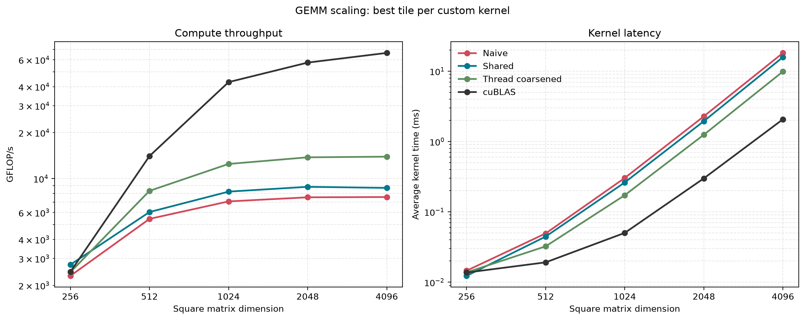
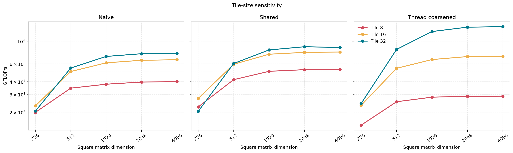
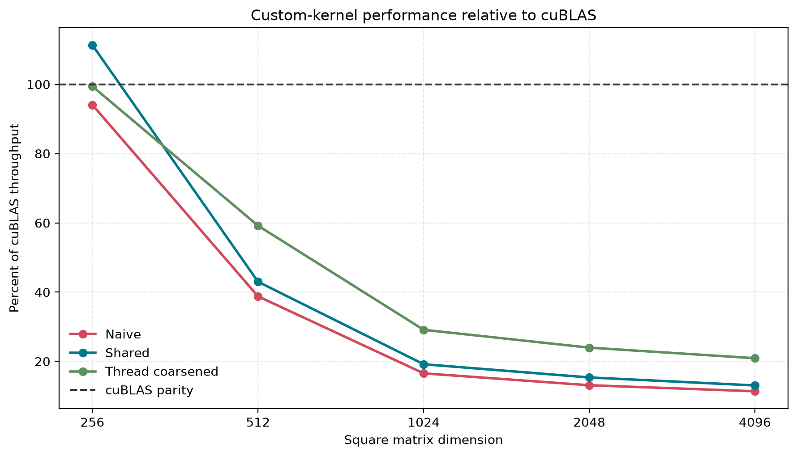
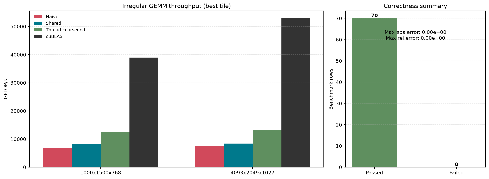

# Week 4: GEMM

## Goal

Implement and benchmark GEMM-style matrix multiplication, progressing from a CPU reference to optimized CUDA kernels and a cuBLAS comparison.

## Progression

1. CPU reference matrix multiplication
2. Naive CUDA matrix multiplication
3. Shared-memory tiled matrix multiplication
4. Register accumulation and thread coarsening
5. Roofline analysis: compute-bound versus memory-bound
6. Comparison against cuBLAS

## Layout

| Directory | Purpose |
|-----------|---------|
| `include/` | Shared GEMM declarations and benchmark interfaces |
| `src/` | CPU, CUDA, and cuBLAS implementations |
| `python/` | Benchmark post-processing and roofline plots |
| `results/raw/` | Raw benchmark output |
| `results/plots/` | Generated charts |
| `results/profiles/` | Nsight Compute reports and metric CSV files |
| `tests/` | Correctness tests |

## Building

```bash
cmake -S week04-gemm -B week04-gemm/build -DCMAKE_BUILD_TYPE=Release
cmake --build week04-gemm/build -j --target week04_benchmark
```

## Running

```bash
./scripts/run_week04.sh [iterations] [warmup_iterations]
```

The defaults are 20 measured iterations and 5 warmup iterations. The runner configures and builds `week04_benchmark`, writes timestamped benchmark CSV and error-report logs under `results/raw/`, generates plots under `results/plots/`, and exits unsuccessfully when a correctness check fails.

Append `--profile` to run the default Nsight Compute profile after benchmarking, or pass a focused profile configuration:

```bash
./scripts/run_week04.sh 20 5 --profile thread_coarse 1024 1024 1024 32
```

Install the visualization dependency in your Python environment with:

```bash
python3 -m pip install matplotlib
```

To regenerate plots from the latest result, or from a specific run:

```bash
python3 week04-gemm/python/plot_results.py
python3 week04-gemm/python/plot_results.py --timestamp 20260808_022931
```

The generated figures cover square-matrix scaling, tile-size sensitivity, performance relative to cuBLAS, irregular dimensions, and correctness status.

Each benchmark invocation runs the naive, shared-memory, and four-row thread-coarsened kernels with tile sizes `8`, `16`, and `32`, followed by a cuBLAS SGEMM baseline. The cuBLAS row uses `tile_size=0` because its internal tiling is not controlled by this benchmark.

Results are emitted as CSV with throughput, maximum absolute and relative error, failing-element count, and `PASS`/`FAIL` status against the CPU reference. A summary error report is written to stderr. Validation uses combined tolerances of `atol=1e-3` and `rtol=1e-3`; the process exits unsuccessfully if any run exceeds them.

The benchmark covers square matrices of sizes `256`, `512`, `1024`, `2048`, and `4096`, plus irregular `1000x1500x768` and `4093x2049x1027` GEMM problems (`M x N x K`).

## Results

### GEMM Scaling

The best tile for each custom kernel is compared with cuBLAS across square matrices. Thread coarsening is the strongest custom implementation at larger dimensions, while cuBLAS maintains a substantial throughput lead.



### Tile-Size Sensitivity

Tile size `32` provides the highest sustained throughput for the larger problems, especially for the thread-coarsened kernel.



### cuBLAS Comparison

The custom kernels become a smaller fraction of cuBLAS throughput as the matrices grow. The thread-coarsened implementation retains roughly 21% of cuBLAS throughput at dimension `4096`.



### Irregular Dimensions and Correctness

The same performance ordering holds for irregular dimensions. All 70 benchmark configurations passed the CPU-reference checks with zero recorded absolute and relative error.



## Nsight Compute Profiling

Run a focused profile with:

```bash
./scripts/profile_week04.sh [naive|shared|thread_coarse|cublas] [M] [N] [K] [tile_size]
```

For example:

```bash
./scripts/profile_week04.sh shared 1024 1024 1024 16
./scripts/profile_week04.sh thread_coarse 1024 1024 1024 32
./scripts/profile_week04.sh shared 1000 1500 768 32
./scripts/profile_week04.sh cublas 4096 4096 4096 16
```

The default is `shared 1024 1024 1024 16`. Tile size is ignored by cuBLAS but remains part of the report name. The script profiles one warmed-up operation and writes an interactive `.ncu-rep` plus raw CSV metrics under `results/profiles/`.

| Requested signal | Nsight Compute section |
|------------------|-------------------------|
| DRAM throughput | `MemoryWorkloadAnalysis`, `SpeedOfLight` |
| L1/L2 hit rate | `MemoryWorkloadAnalysis` |
| FP32 utilization | `SpeedOfLight`, `InstructionStats` |
| Eligible warps per scheduler | `SchedulerStats` |
| Achieved occupancy | `Occupancy` |
| Register usage | `LaunchStats` |
| Shared-memory utilization | `MemoryWorkloadAnalysis`, `LaunchStats` |
| Barrier stalls | `WarpStateStats` |
| Long scoreboard stalls | `WarpStateStats` |
| Instruction throughput | `InstructionStats`, `SpeedOfLight` |

Metric names differ between GPU architectures and Nsight Compute releases. Collecting the owning sections lets NCU select supported architecture-specific counters while preserving these measurements.